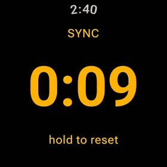
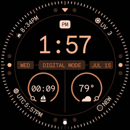
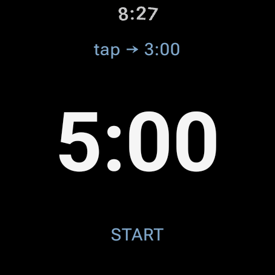
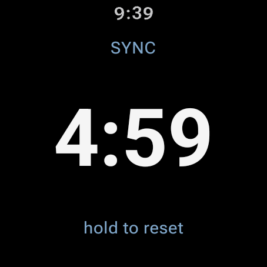
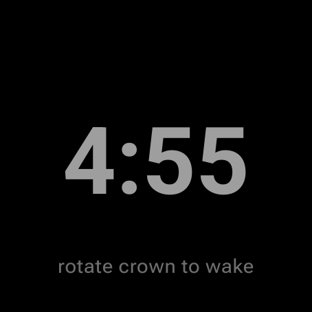
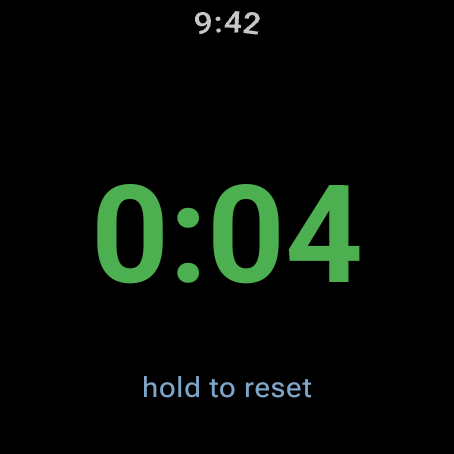
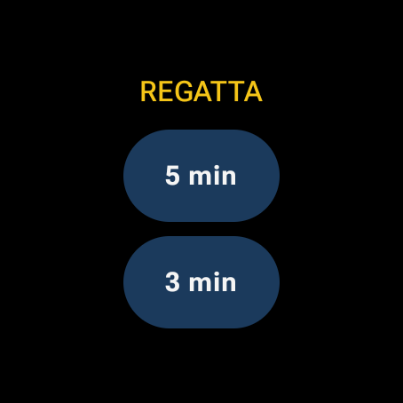
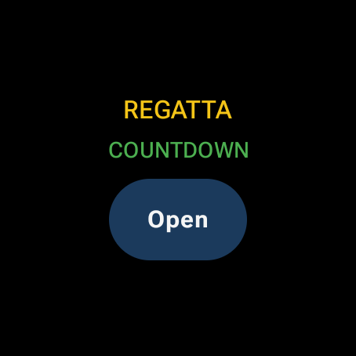
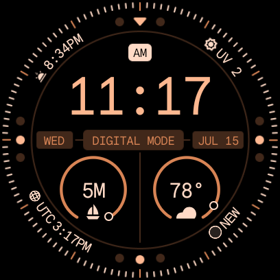
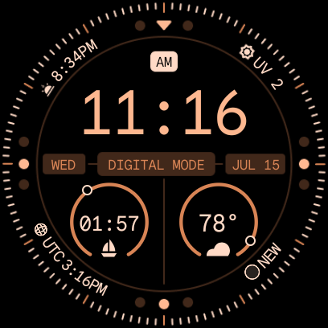

<p align="center">
  
</p>

# Regatta Timer

[](https://github.com/johnhringiv/regatta-timer/actions/workflows/android.yml)

**[→ regatta-timer.johnhringiv.com](https://regatta-timer.johnhringiv.com/)**

A sailing race start timer for Wear OS (built for and tested on the Pixel Watch 3). Fully standalone — no phone, no companion app, no account, no network. Built because nothing on the market handled a real start line: the screen must never leave the timer mid-sequence, and a missed start press must be correctable at the next gun.

<p align="center">
  
  
</p>

## 🙋 Beta testers wanted

The beta is live on Google Play (closed testing) — no sideloading needed. Google requires **12 testers enrolled for 14 days** before the app can go public, so every tester genuinely helps. If you sail (or just own a Wear OS watch):

1. [**Open an issue**](https://github.com/johnhringiv/regatta-timer/issues/new?title=Beta+tester) — or email [play@johnhringiv.com](mailto:play@johnhringiv.com) — with the Google account email you use on the Play Store (closed testing is invite-only)
2. Once added, **[opt in here](https://play.google.com/apps/testing/com.johnhringiv.regattatimer)**
3. Install from **[the Play Store listing](https://play.google.com/store/apps/details?id=com.johnhringiv.regattatimer)** on your watch — updates arrive automatically like any app

## Features

- **5-minute (RRS 26) and 3-minute start sequences**
- **Sync to nearest minute** — tap SYNC at any gun to correct the countdown (3:22 → 3:00, 3:40 → 4:00)
- **Automatic count-up** after the start for elapsed race time
- **Haptic signals**: double buzz at 4:00 (prep), long buzz at 1:00, ticks through the final 10 seconds, gun blast at 0:00
- **Screen never leaves the app** while armed or counting down; count-up dims to an always-on ambient display
- **Wet-proof**: countdown, display, and haptics keep running even when water forces the watch into ambient mode; huge half-screen touch targets; long-press-guarded reset so splashes can't kill your sequence
- **Quick-launch tile**: swipe from the watch face, tap 5 min or 3 min, and the timer opens pre-armed
- **Watch-face complication**: weather-style ring where the dot is time remaining, ticking countdown in the center — one tap starts the last-used sequence right from the face
- **Survives interruptions**: an in-flight countdown or race is restored at the correct time even if the app is closed — or the watch reboots
- **Battery guard**: an armed timer releases the screen after 10 idle minutes (any tap re-arms it); the countdown itself always holds the screen
- **Free, no ads, no tracking**: GPL open source; no account, no network, [no data collection](https://regatta-timer.johnhringiv.com/privacy.html) — about 2 MB

### The app

| Armed                                | Countdown                                    | Wet (ambient)                            | Race                                      |
| ------------------------------------ | -------------------------------------------- | ---------------------------------------- | ----------------------------------------- |
|  |  |  |  |

### The tile

Swipe from the watch face. When a timer is in flight the tile says so instead of offering to arm a new one.

| Ready to arm                                   | Timer in flight                                    |
| ---------------------------------------------- | -------------------------------------------------- |
|  |  |

### The complication

Put the timer in a watch-face complication slot: a ring where the dot is time remaining, a ticking countdown in the center, and a sailboat at the bottom (on faces that render ranged values, like the Pixel defaults). Armed, it shows the last-used sequence (`5m`/`3m`); one tap starts it with the app opening mid-count.

| Armed on the face                                              | Counting down                                                          |
| -------------------------------------------------------------- | ---------------------------------------------------------------------- |
|  |  |

**Worth knowing**: in always-on (ambient) display, watch faces refresh complications about once a minute, so the countdown on the _face_ can read up to a minute stale until you turn your wrist — identical to the built-in stopwatch/timer complications. Inside the app, the countdown stays live to the second even in ambient.

## Install (sideload)

Grab the APK from [Releases](https://github.com/johnhringiv/regatta-timer/releases), then:

1. **On the watch** — enable developer mode: Settings → System → About → tap **Build number** 7 times. Then Settings → **Developer options** → enable **ADB debugging** and **Wireless debugging** (watch and computer on the same Wi-Fi).
2. **Pair (one time)** — on the watch open Wireless debugging → **Pair new device**; on your computer:
   ```
   adb pair <ip>:<pairing-port> <6-digit-code>
   ```
3. **Connect and install** — the main Wireless debugging screen shows a different port:
   ```
   adb connect <ip>:<port>
   adb install RegattaTimer-v<version>.apk
   ```

Needs Wear OS 5+ (minSdk 34). `adb` ships with [Android platform-tools](https://developer.android.com/tools/releases/platform-tools).

## Building from source

```
./gradlew :app:assembleDebug        # debug build
./gradlew :app:assembleRelease      # release (signed if keystore.properties exists, else unsigned)
./gradlew :app:testDebugUnitTest    # unit tests
```

Requires JDK 17+ and the Android SDK (compileSdk 37). Release signing reads `keystore.properties` at the repo root (gitignored); CI restores it from the `KEYSTORE_B64` / `KEYSTORE_PASSWORD` secrets.

After cloning, enable the repo hooks (auto-formats Markdown with Prettier on commit; CI enforces):

```
git config core.hooksPath .githooks
```

## Versioning

- **`versionCode`** (integer) — bumped on **every change** pushed to a feature branch; CI rejects PRs where it hasn't increased past `main`.
- **`versionName`** (e.g. `0.5`) — bumped **once per PR to `main`**; CI enforces it differs from `main`. Merges to `main` automatically publish a GitHub release with the APK.

## License

Copyright © 2026 **John H. Ring IV**

This program is free software: you can redistribute it and/or modify it under the terms of the [GNU General Public License](LICENSE) as published by the Free Software Foundation, either version 3 of the License, or (at your option) any later version. It is distributed in the hope that it will be useful, but WITHOUT ANY WARRANTY; without even the implied warranty of MERCHANTABILITY or FITNESS FOR A PARTICULAR PURPOSE.

Stopwatch glyph from [Bootstrap Icons](https://icons.getbootstrap.com/) (MIT, compatible).
